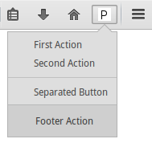
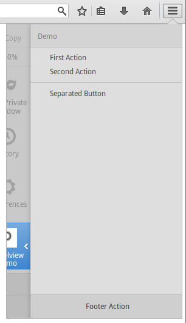

The `panelview` module provides a simple way to create a Panelview/Subview like the History or Bookmarks panels offer in Australis.

## Usage ##
This module exports a single constructor function `PanelView` which constructs a panelview object.

A panelview is like a menu but can additionally have a header and a footer. The header is only displayed when opened inside the menu. The benefits of using a panelview over a menu or even a normal panel is that it opens as a subview when the button is inside the menu.
Even though it could probably contain other things than just menu items, you can currently only add menu items and separators to a panelview. Due to the XUL element being poorly documentated (the only real documentation is existing code...), it is uncertain how the element is intended to be used.

`panelview` exposes a similar API to `sdk/panel`, however it offers less functionality, due to the content restrictions.

For the usage of third party libraries together with the SDK, check out [this Toutorial](https://developer.mozilla.org/en-US/Add-ons/SDK/Tutorials/Add_a_Menu_Item_to_Firefox).

### Content Items ###
When constructing a panelview you have to add content items. These may either be buttons or separators.
```js
var { PanelView } = require("panelview");

let pv = PanelView({
    id: 'demo-panelview',
    title: 'Demo',
    content: [
        {
            type: 'button',
            label: 'First Action',
            onClick: function(event) {
                // action handler for the first action
            }
        },
        {
            type: 'button',
            label: 'Second Action',
            onClick: function(event) {
                // handler for the second event
            }
        },
        {
            type: 'separator'
        },
        {
            type: 'button',
            label: 'Separated Button',
            onClick: function(event) {
                // another event handler
            }
        }
    ],
    footer: {
        label: 'Footer Action',
        onClick: function(event) {
            // footer click handler
        }
    }
});
```




### Usage with SDK buttons ###
To use an SDK Action button or ToggleButton (recommended) together with a panelview you will have to apply a fix to the button, so the menu panel doesn't close when clicked on the button in the panel.
You can easily apply the fix:
```js
    let button = ToggleButton({...});
    require("panelview/workaround").applyButtonFix(button);
```
This fix currently doesn't work correctly with windows opened after the function is called, even though the code for it is in place.

Using a panelview on a ToggleButton will sometimes uncheck it when the panelview is closed, which is quite convenient.

## Globals ##
### Constructors ###
#### PanelView(options) ####
Creates a panelview.

##### Parameters #####
###### options: object ######
Required options:
   * __id__: ID of the panelview, has to be unique.
   * __title__: Title of the panelview, displayed on top when opened from the firefox menu.
   * __content__: Array of content items. Content items consist at least of a __type__ attribute, which is either "button" or "separator".

     If you choose "button" as type, you need to supply a __label__ and __onClick__ attribute. You can optionally supply __disabled__,__icon__,__actionType__ (to define the button type) and __accesskey__.

     The onClick function gets the event details from the click on the button, so it can for example react to state changes for special button types.
Optional options:
   * __footer__: An object containing a __label__ and __onClick__. The footer is displayed at the bottom and usually offers an action which opens new tabs or windows.
   * __onShow__: Event listener for the show event.
   * __onHide__: Event listener for the hide event.

__onClick__ always automatically closes the panelview unless the actionType is "checkbox" or "radio".
## PanelView ##
### Methods ###
#### destroy() ####
Destroys the panelview and its contents and removes it from the window's DOM.
#### show(button) ####
Opens the panelview from the supplied button.
##### Parameters #####
###### button: ToggleButton or ActionButton ######
Button the Panelview is anchored on.
#### hide(closePanel) ####
Hides the panelview if showing. If it is opened as separate panel the panel is closed. If it is opened as subview in the menu the menu goes back to the main view.
##### Parameters #####
###### closePanel: boolean ######
Optionally forces the panel to be closed, even if the view is displayed as subview. Defaults to false.
#### on(type, listener) ####
Register an event listener.
##### Parameters #####
###### type: String ######
The event type.
###### listener: function ######
the event listener.
#### once(type, listener) ####
Register an event listener which only listens for the event once.
##### Parameters #####
###### type: String ######
The event type.
###### listener: function ######
the event listener.
#### removeListener(type, listener) ####
Remove an event listener.
##### Parameters #####
###### type: String ######
The event type.
###### listener: function ######
the event listener.
#### off(type, listener) ####
Same as `removeListener`.
### Properties ###
#### id ####
The ID of the PanelView
#### isShowing ####
Returns true if the panelview is currently either displayed as a standalone panel or in the menu panel. Consider this method unreliable due to transitioning times.
### Events ###
#### show ####
This event is emitted whenever the panelview gets displayed.
#### hide ####
This event is emitted when the panelview is hidden.
